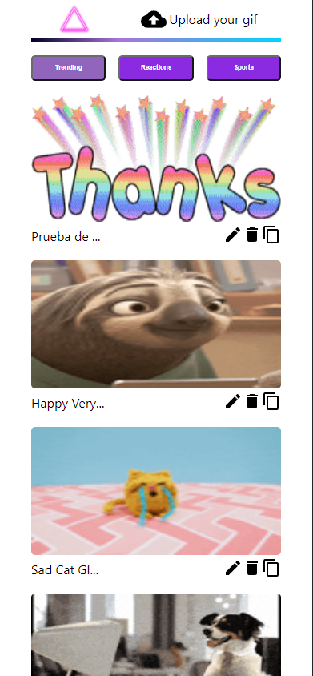
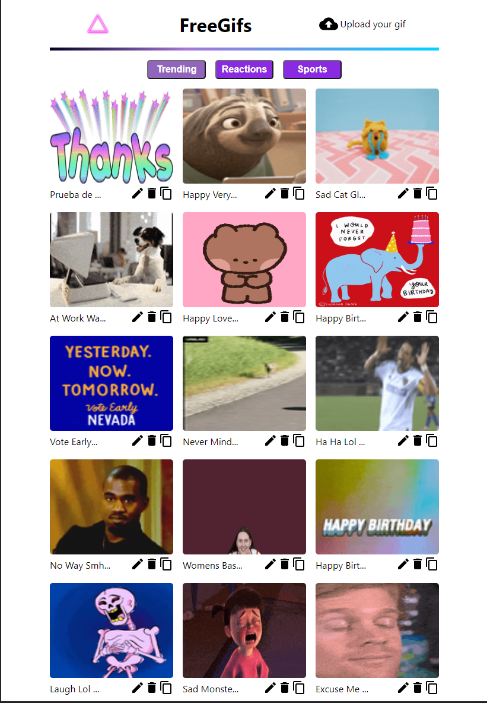
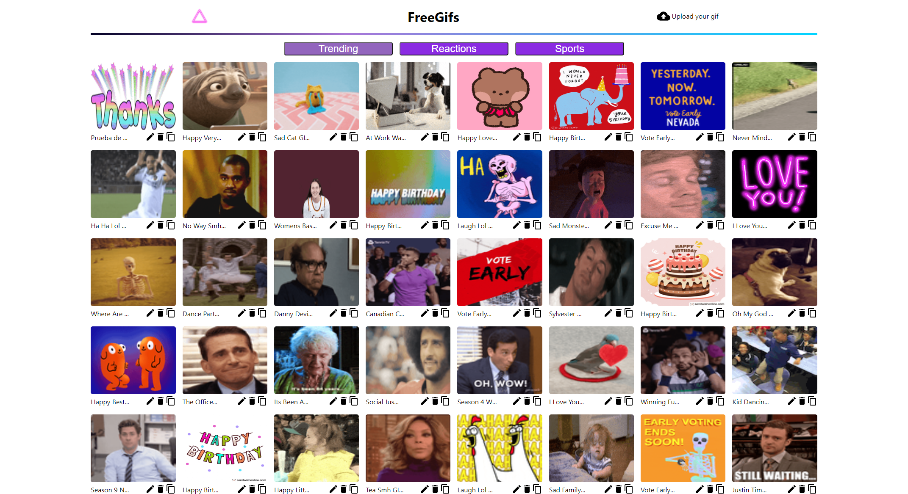

This is a [Next.js](https://nextjs.org/) project bootstrapped with [`create-next-app`](https://github.com/vercel/next.js/tree/canary/packages/create-next-app).

## Getting Started
Use npm i to install all the dependecies
First, run the development server:

```bash
npm run dev
# or
yarn dev
```

Open [http://localhost:3000](http://localhost:3000) with your browser to see the result.

## Technologies
-Next.js<br>
-Typescript<br>
-Material UI<br>
-Toast<br>
-CSS modules

### This project
Consits in a CRUD, where the users could see, create, update and delete the giphs and navigate between three categories

## wireframes

Iphone:<br>


ipad:<br>


PC:<br>

